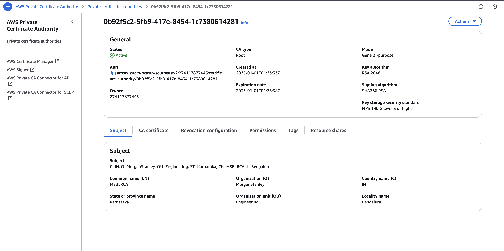
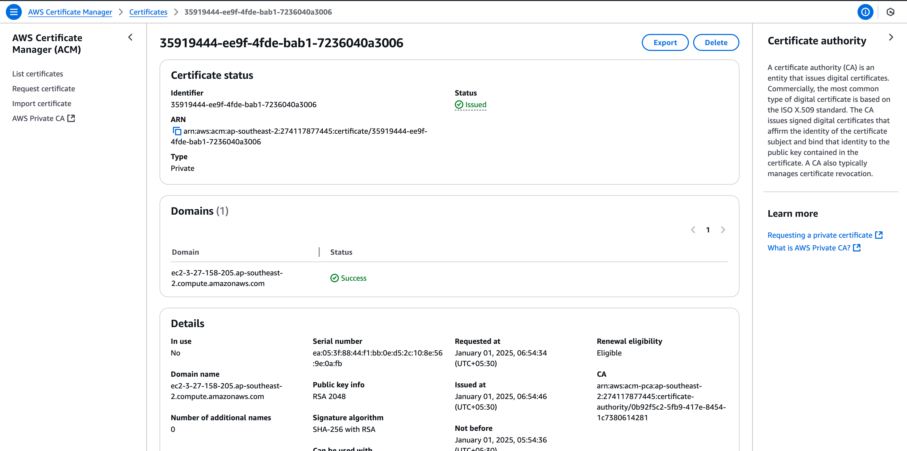
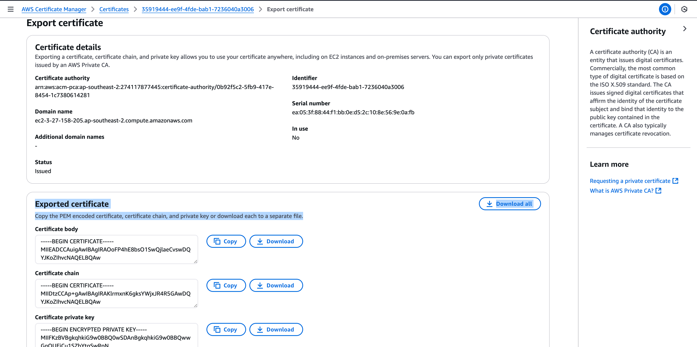
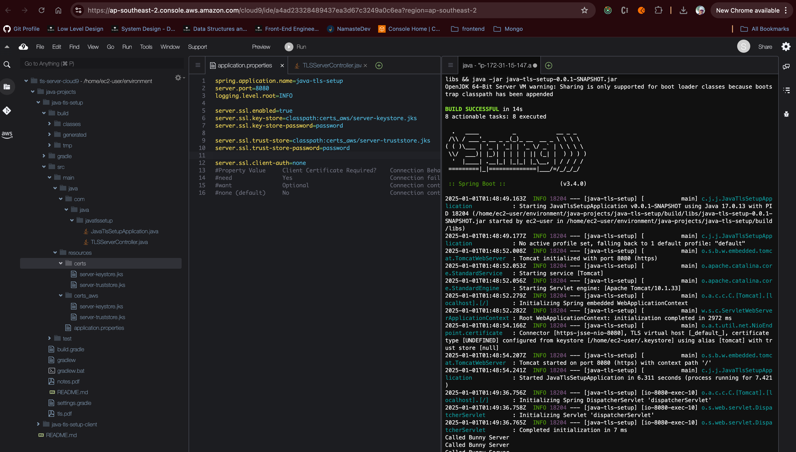
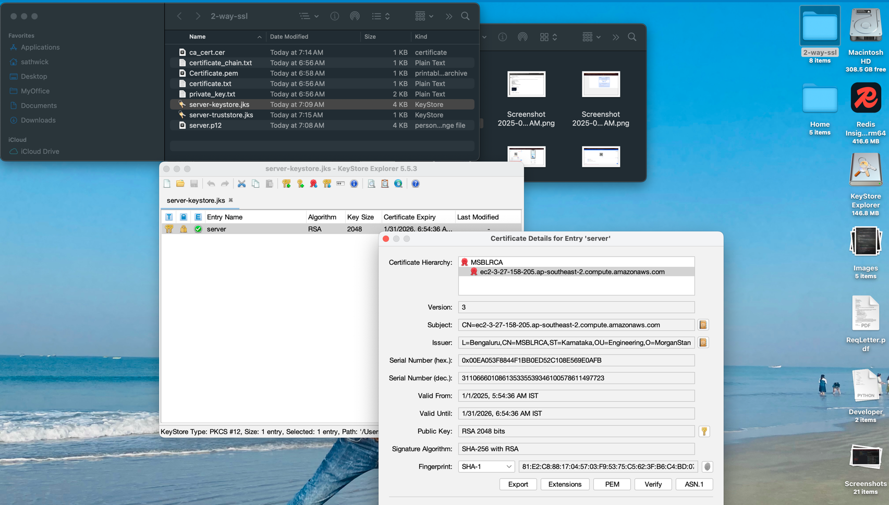
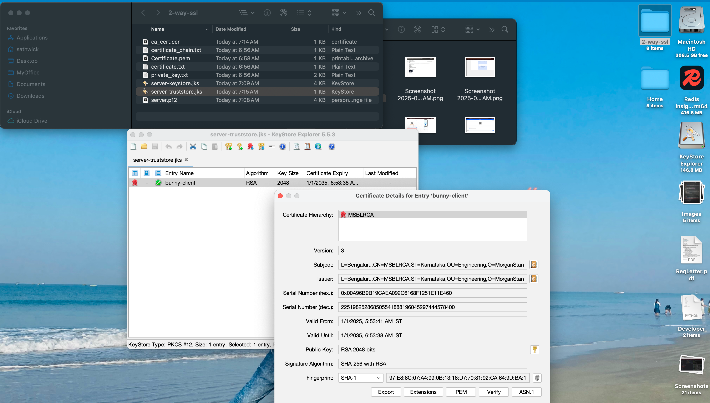

# 1. Steps for Setting Up 2-Way SSL in local Manual setup

## 1. CA Key Generation
1. Generate the CA private key:
```
   openssl genrsa -out ca-key.pem 4096
```

2. Create the CA certificate:
```
   openssl req -new -x509 -sha256 -days 1000 -key ca-key.pem -out ca-cert.pem
```
   > - Enter the following details when prompted:
   > - Country Name (2 letter code) [AU]: IN
   > - State or Province Name (full name) [Some-State]: Telangana
   > - Locality Name (eg, city) []: Hyderabad
   > - Organization Name (eg, company) [Internet Widgits Pty Ltd]: MS
   > - **Organizational Unit Name (eg, section) []: Treasury CA**
   > - Common Name (e.g. server FQDN or YOUR name) []:
   > - Email Address []:

---

## 2. Server-Side Process
1. Generate the server private key:
```
openssl genrsa -out server-key.pem 4096
```

2. Create a certificate signing request (CSR) for the server:
```
   openssl req -new -sha256 -key server-key.pem -out server-csr.csr
```
> - Enter the following details when prompted:
> - Country Name (2 letter code) [AU]: IN
> - State or Province Name (full name) [Some-State]: Telangana
> - Locality Name (eg, city) []: Hyderabad
> - Organization Name (eg, company) [Internet Widgits Pty Ltd]: MS
> - **Organizational Unit Name (eg, section) []: Treasury Server**
> - Common Name (e.g. server FQDN or YOUR name) []:
> - Email Address []:
> - Challenge password []: password
> - Optional company name []:

3. Create a configuration file for subject alternative names:
```
   touch server-extfile.cnf && vi server-extfile.cnf
```

4. Add the following content to `server-extfile.cnf`:
```
   subjectAltName=DNS:*.bunny-server.com
```

5. Sign the server CSR with the CA certificate and key:
```
   openssl x509 -req -sha256 -days 1000 -in server-csr.csr \
   -CA ca-cert.pem -CAkey ca-key.pem -out server-cert.pem \
   -extfile server-extfile.cnf -CAcreateserial
```
---

## 3. Client-Side Process
1. Generate the client private key:
```
   openssl genrsa -out client-key.pem 4096
```

2. Create a certificate signing request (CSR) for the client:
```
   openssl req -new -sha256 -key client-key.pem -out client-csr.csr
```
> -    Enter the following details when prompted:
> -   Country Name (2 letter code) [AU]: IN
> -   State or Province Name (full name) [Some-State]: Telangana
> -   Locality Name (eg, city) []: Hyderabad
> -   Organization Name (eg, company) [Internet Widgits Pty Ltd]: MS
> -   **Organizational Unit Name (eg, section) []: Treasury Client**
> -   Common Name (e.g. server FQDN or YOUR name) []:
> -   Email Address []:
> -   Challenge password []: password
> -   Optional company name []:

3. Create a configuration file for subject alternative names:
```
   touch client-extfile.cnf && vi client-extfile.cnf
```

4. Add the following content to `client-extfile.cnf`:
```
   subjectAltName=DNS:*.bunny-client.com
```

5. Sign the client CSR with the CA certificate and key:
```
   openssl x509 -req -sha256 -days 1000 -in client-csr.csr \
   -CA ca-cert.pem -CAkey ca-key.pem -out client-cert.pem \
   -extfile client-extfile.cnf -CAcreateserial
```
---

## 4. Converting Certificates to JKS

### Server-Side Conversion
1. Combine the CA certificate, server certificate, and private key into one file:
```   
cat ca-cert.pem server-cert.pem server-key.pem > server-combined.pem
```

2. Convert to PKCS12 format:
```
   openssl pkcs12 -export \
   -in server-combined.pem \
   -out server-cert.p12 \
   -name bunny-server
```
3. Import into a Java Keystore (JKS):
```
   keytool -importkeystore \
   -srckeystore server-cert.p12 \
   -srcstoretype pkcs12 \
   -destkeystore server-keystore.jks
```
### Client-Side Conversion
1. Combine the CA certificate, client certificate, and private key into one file:
```
cat ca-cert.pem client-cert.pem client-key.pem > client-combined.pem
```

2. Convert to PKCS12 format:
```
   openssl pkcs12 -export \
   -in client-combined.pem \
   -out client-cert.p12 \
   -name bunny-client
```

3. Import into a Java Keystore (JKS):
```
   keytool -importkeystore \
   -srckeystore client-cert.p12 \
   -srcstoretype pkcs12 \
   -destkeystore client-keystore.jks
```
---

## 5. Importing CA Certificates into Trust Stores
### Explanation of Trust Store Purpose
The trust stores ensure that both sides (client and server) trust the same Certificate Authority (CA). This enables mutual authentication during SSL handshake.

### Server Trust Store
1. Convert `ca-cert.pem` to `.cer` format:
```
   cp ca-cert.pem ca-cert.cer
```

2. Import the CA certificate into the server's trust store:
```
   keytool -importcert \
   -keystore server-truststore.jks \
   -file ca-cert.cer \
   -alias bunny-client \
   -storepass password \
   -trustcacerts \
   -deststoretype pkcs12
```

### Client Trust Store
1. Import the CA certificate into the client's trust store using an alias like `bunny-server`:
```
   keytool -importcert \
   -keystore client-truststore.jks \
   -file ca-cert.cer \
   -alias bunny-server \
   -storepass password \
   -trustcacerts \
   -deststoretype pkcs12
```
---

# 2. Achieving the same with Private CA and Signed Server Certificate (Corporate Way)

## 1. Generate a Private CA



## 2. Generate a Server Certificate




## 3. Convert these certificates to pkcs followed by JKS

Note: Below steps prompts for password, must note down the password
```
openssl pkcs12 -export \
  -inkey private_key.txt \
  -in certificate.txt \
  -certfile certificate_chain.txt \
  -out server.p12 \
  -name server
```
```
keytool -importkeystore \
-srckeystore server.p12 \
-srcstoretype pkcs12 \
-destkeystore server-keystore.jks
```
- Now also create the trust store with CA Root certificate this ensures any requests
coming with CA Root certificate can be trusted to establish connection.
- KeyStore responsible for sharing the certificate to other entities inorder to establish trust & allowing clients
to create session key encrypted with server's public key and then send it back to the server in encrypted form and then server decrypts it and uses it to decrypt the session key and then uses it to decrypt the data.

- Now configure in the spring project



#### Verify the server-keystore.jks and server-truststore.jks





## Test Connections

### Browser as Client 


### Terminal as Client

| **Code**                      | **Image**                                    |
|-------------------------------|----------------------------------------------|
| ```bash                       |
sathwick@Sathwicks-MacBook-Air 2-way-ssl % curl --cacert  Certificate.pem  --verbose https://ec2-3-27-158-205.ap-southeast-2.compute.amazonaws.com:8080/hello
* Host ec2-3-27-158-205.ap-southeast-2.compute.amazonaws.com:8080 was resolved.
* IPv6: (none)
* IPv4: 3.27.158.205
*   Trying 3.27.158.205:8080...
* Connected to ec2-3-27-158-205.ap-southeast-2.compute.amazonaws.com (3.27.158.205) port 8080
* ALPN: curl offers h2,http/1.1
* (304) (OUT), TLS handshake, Client hello (1):
*  CAfile: Certificate.pem
*  CApath: none
* (304) (IN), TLS handshake, Server hello (2):
* (304) (IN), TLS handshake, Unknown (8):
* (304) (IN), TLS handshake, Certificate (11):
* (304) (IN), TLS handshake, CERT verify (15):
* (304) (IN), TLS handshake, Finished (20):
* (304) (OUT), TLS handshake, Finished (20):
* SSL connection using TLSv1.3 / AEAD-CHACHA20-POLY1305-SHA256 / [blank] / UNDEF
* ALPN: server did not agree on a protocol. Uses default.
* Server certificate:
*  subject: CN=ec2-3-27-158-205.ap-southeast-2.compute.amazonaws.com
*  start date: Jan  1 00:24:36 2025 GMT
*  expire date: Jan 31 01:24:36 2026 GMT
*  subjectAltName: host "ec2-3-27-158-205.ap-southeast-2.compute.amazonaws.com" matched cert's "ec2-3-27-158-205.ap-southeast-2.compute.amazonaws.com"
*  issuer: C=IN; O=MorganStanley; OU=Engineering; ST=Karnataka; CN=MSBLRCA; L=Bengaluru
*  SSL certificate verify ok.
* using HTTP/1.x
*  GET /hello HTTP/1.1
*  Host: ec2-3-27-158-205.ap-southeast-2.compute.amazonaws.com:8080
*  User-Agent: curl/8.7.1
*  Accept: */*
* Request completely sent off
  < HTTP/1.1 200
  < Content-Type: text/plain;charset=UTF-8
  < Content-Length: 23
  < Date: Wed, 01 Jan 2025 01:52:10 GMT
  <
* Connection #0 to host ec2-3-27-158-205.ap-southeast-2.compute.amazonaws.com left intact
  Hello, from TLS Server!%

sathwick@Sathwicks-MacBook-Air 2-way-ssl % ``` |  |

---


# 3. Hand Written Notes On Concepts 

<embed src="https://github.com/sathwickreddyy/java-projects/tree/main/java-tls-setup/notes.pdf" type="application/pdf" width="100%" height="600px" />

[View PDF](https://github.com/sathwickreddyy/java-projects/tree/main/java-tls-setup/notes.pdf)

# 4. Glossory
## What is a Certificate Authority (CA)?

A Certificate Authority (CA) is like a trusted third party that acts as a "notary" for digital certificates. It verifies the identity of entities (like servers or clients) and issues certificates that prove their authenticity. These certificates are used in SSL/TLS communication to establish trust between parties.

### Think of it like this:
- The CA is a trusted organization everyone agrees to trust.
- The CA issues certificates to entities (clients or servers) after verifying their identity.
- If both parties trust the CA, they can trust each other without directly knowing each other beforehand.

---

## Why Use a CA for 2-Way SSL?

In 2-way SSL, both the client and server need to verify each other's identities:
- The server needs to ensure that the client is legitimate.
- The client needs to ensure that the server is legitimate.

### Using a CA simplifies this process:
- Instead of manually exchanging and trusting individual certificates, both the client and server trust the CA's root certificate.
- The CA signs certificates for both the client and server. Since both parties trust the CA, they automatically trust each other's certificates.

---

## How Does It Work?

Here’s how trust is established in 2-way SSL with a CA:

### 1. The CA Issues Certificates:
- The server generates a certificate signing request (CSR) and sends it to the CA.
- The client does the same.
- The CA verifies their identities and signs their certificates using its private key.

### 2. Trusting the CA:
- Both the client and server install the CA's root certificate in their respective truststores.
- This root certificate acts as proof that any certificate signed by the CA can be trusted.

### 3. SSL Handshake:
- When the client connects to the server, they exchange certificates.
- Each party verifies that the other's certificate was signed by the trusted CA.
- If verification succeeds, they establish an encrypted connection.

---

## Step-by-Step Process

### 1. Set Up Your Own Certificate Authority
You can create your own private CA if you don’t want to use a public one like Let’s Encrypt or DigiCert.

Generate a root certificate for your CA:
```
openssl genrsa -out rootCA.key 2048
openssl req -x509 -new -nodes -key rootCA.key -sha256 -days 3650 -out rootCA.pem \
    -subj "/C=US/ST=State/L=City/O=YourOrg/OU=IT/CN=RootCA"
```

This `rootCA.pem` file will be used to sign client and server certificates.

---

### 2. Generate Server and Client Certificates
For each entity (server or client):

#### Create a private key:
```
openssl genrsa -out server.key 2048
```


#### Create a CSR (Certificate Signing Request):
```
openssl req -new -key server.key -out server.csr \
    -subj "/C=US/ST=State/L=City/O=YourOrg/OU=IT/CN=server"

```

#### Sign the CSR with your CA:

```
openssl x509 -req -in server.csr -CA rootCA.pem -CAkey rootCA.key \
    -CAcreateserial -out server.crt -days 3650 -sha256

```

Repeat these steps for the client, replacing `server` with `client`.

---

### 3. Distribute Certificates
- Give each party its own private key (`server.key` or `client.key`) and signed certificate (`server.crt` or `client.crt`).
- Distribute the CA's root certificate (`rootCA.pem`) to both parties so they can verify each other's certificates.

---

### 4. Configure Truststores
Add the CA's root certificate (`rootCA.pem`) to both the server's and client's truststores.

For example, in Java:
```
keytool -importcert -alias root-ca \
    -file rootCA.pem \
    -keystore truststore.jks \
    -storepass password
```


---

### 5. Enable Mutual Authentication in Spring Boot

#### Server (`application.yml`):
```
server:
  port: 8443
  ssl:
    enabled: true
    key-store: classpath:server-keystore.jks
    key-store-password: password
    trust-store: classpath:server-truststore.jks
    trust-store-password: password
    client-auth: need # Enforces mutual authentication
```

#### Client (`application.yml`):
```
spring:
  ssl:
    key-store: classpath:client-keystore.jks
    key-store-password: password
    trust-store: classpath:client-truststore.jks
    trust-store-password: password
```


---

## Advantages of Using a CA

1. **Simplifies Trust Management**:
   Instead of manually trusting individual certificates, you only need to trust one root certificate (the CA).

2. **Scalability**:
   When new clients or servers are added, they just need certificates signed by the same CA—no need to update everyone else’s truststores.

3. **Revocation**:
   If a certificate is compromised, you can revoke it through a Certificate Revocation List (CRL) or Online Certificate Status Protocol (OCSP).

4. **Widely Used Practice**:
   This is how most secure systems work today, including websites using HTTPS.

---

## Real-Life Analogy

Imagine you're organizing an event where attendees need ID badges:
1. You hire an official badge provider (the CA) who verifies attendees' identities and issues badges.
2. Security guards at the event only need to recognize badges issued by this provider—they don’t need to know every attendee personally.
3. If someone loses their badge, you tell security not to accept it anymore (revocation).

Similarly, in SSL/TLS communication, the CA acts as this trusted badge provider!

By using a Certificate Authority for managing trust in your system, you make it easier to scale securely while reducing manual effort in managing individual certificates between clients and servers.

